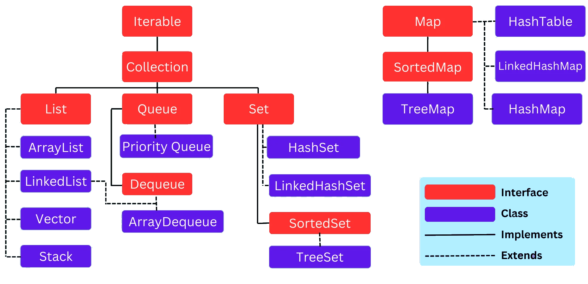
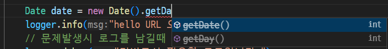

## Java 기초문법

### 기본
- 자바 소스코드 구조

    ```java
    // 한줄 주석.
    /* 여러줄 
       주석. */
    package com.hugo83.spring01; // 자신 프로젝트의 패키지명(폴더)

    import org.springframework.boot.SpringApplication;  // 라이브러리, 클래스 가져오기
    import org.springframework.boot.autoconfigure.SpringBootApplication;

    @SpringBootApplication  // 자바프로젝트 실행을 도와주는 어노테이션
    public class Spring01Application { // 자신 클래스명

        // 엔트리포인트(프로젝트당 하나만 존재)
        public static void main(String[] args) { // 함수, 클래스, 조건문, 반복문시작이 중괄호({)
            SpringApplication.run(Spring01Application.class, args); // 한줄이 끝나면 반드시 ;

            System.out.println("Hello, Spring Boot!"); // 콘솔출력, 문자열을 항상 "
        }
    }
    ```

- 자바특징
    - `간결`하면서 강력한 객체지향 언어
    - `플랫폼 독립적`, OS에 영향을 거의 받지 않음
    - 라이브러리가 아주 다양, `생산성` 향상
    - GUI 프로그램 개발에는 부적합(Swing, JavaFX로 가능)
    - 정밀하게 HW를 제어하는 프로그램에도 부적합

- `JVM`위에서 동작
    - Java Virtual Machine : 도커 컨테이너와 비슷한 개념
    - sourcecode.java -> javac(java compiler) -> bytecode.class -> java로 실행

- 활용분야
    - 웹에 특화. 인터넷 포털, 인터넷 뱅킹, 쇼핑몰, 기업시스템
    - 초기 안드로이드 개발 대표 언어였음. 현재는 Kotlin으로 변경

### 기초문법

#### 변수
- 변수 선언방법

    ```java
    [접근제어자] 타입 변수명;
    ```
    - 접근제어자 - 변수의 접근범위를 지정하는 키워드(public, default, protected, private)
    - 타입 - 자료형. 자바는 명시적으로 타입 지정해야 함
    - 변수명 - 일반적인 변수명 지정법과 동일

    ```java
    int account = 10000000;     // 정수형(Primitive type)
    private String sayhi = "Hello!";    /// 문자열형(Class type)
    MyClass inst = new MyClass();     // 사용자정의 클래스형
    ```

- 변수종류
    - 지역변수, 전역변수, 매개변수, 멤버변수, 인스턴스변수...

#### 자료형
- 원시자료형(Primitive type)

    |구분|자료형|크기|설명|
    |:---:|:---:|:---|:---|
    |정수형|byte|1byte, -128~127|가장 작은단위, 8bit |
    |      |char|2bytes, 0~65535|unsigned자료형, 문자표현용 |
    |      |short|2bytes, -32768~32767|signed자료형, 작은데이터처리용 |
    |      |int|4bytes, -2147백만~2147백만|기본자료형  |
    |      |long|8bytes, -922경~922경|큰정수자료형, 숫자뒤에 L표시 |
    |실수형|float|4bytes, 1.4E-45~3.40E38|실수형, 숫자뒤에 F표시 |
    |      |double|8bytes, 4.9E-324~1.79E308|실수형기본자료형 |
    |논리형|boolean|1byte, true또는false |논리형, 참/거짓표현용 |

    ```java
    int number; 
    char ch_first = 'a';  
    long longnum = 2345678L;
    float fnum = 3.141592F;
    boolean isTrue = false;
    ```

#### 연산자
- 연산자는 거의 대부분의 언어에서 동일하게 사용
    - 사칙연산 : +, -, * , /, %
    - 대입연산 : =, +=, -=, *=, /=, %=, ++(a++, a = a + 1 동일), -- 
    - 비트연산 : &, |, ^, ~, >>, <<
    - 논리연산 : &&, ||, !
    - 관계연산 : ==, >, >=, <, <=, !=

    - [Java문법실습](./day01/spring01/src/main/java/com/hugo83/spring01/Spring01Application.java)

#### 흐름제어
- 조건(분기)문 : if문, switch문
    - if문
    
    ```java
    if (조건식) {
        // if문 안으로 들어와서
        실행코드 블럭;
    } else if (조건식) {
        실행코드 블럭;
    } else {
        // 어디에도 참이 되지 않으면...
        실행코드 블럭;
    }
    ```

    - switch(-case)문 - 조건값에 따라 여러 분기로 나눌때 좋음. if문으로 대체 가능

    ```java
    switch (입력변수) {
        case 조건값1:
            실행코드 블럭;
            break;
        case 조건값2:
            실행코드 블럭;
        case 조건값3:
            실행코드 블럭;
            break;  // 조건값2에서 시작하면 조건값3까지 모두 수행
        default:
            기본실행코드 블럭;
            break; // case나 default에 되도록이면 빼지말것
    }
    ```

    - 3항 연산 - 간단하게 구현할 조건문 if-else 대신 사용. 실행코드 블럭이 한줄일때

    ```java
    String result = (isLogin) ? "로그인성공!" : "로그인실패";

    String result;
    if (isLogin) {
        result = "로그인성공!";    
    } else {
        result = "로그인실패";
    }
    ``` 
    - [Java문법실습](./day01/spring02/src/main/java/com/hugo83/spring02/Spring02Application.java)

- 반복문 : for문, while문, do-while문

    - for문 - 대표적인 반복문

    ```java
    // 일반적인 반복문
    for (초기값; 조건식; 증감식) {
        실행코드 블럭;
    }

    // 배열, 컬렉션을 처리하는 반복문
    for (변수 : 컬렉션데이터) {
        실행코드 블럭;
    }
    ```

    - [Java문법실습](./day01/spring03/src/main/java/com/hugo83/spring03/Spring03Application.java)

    - while문 - 조건식이 참인동안 계속 반복

    ```java    
    while (조건식) {
        실행코드 블럭;
    }
    ```

    - do-while문 - 우선 실행코드를 한번 수행 후 조건을 검사후 반복

    ```java    
    do {
        실행코드 블럭;
    } while(조건식);

    ```

    - [Java문법실습](./day02/spring01/src/main/java/com/hugo83/spring01/Spring01Application.java)

- 반복제어 키워드 : break, continue
    - for문, while문 내에서 사용
    - break - 조건에 맞아 반복문을 탈출할 때
    - continue - 특수 조건만 비켜서 반복문을 계속할 때

#### 배열
- 여러 데이터가 필요할 경우 하나의 변수로 처리 가능
- 여러개의 데이터를 순차적으로 저장할 때 인덱스가 0부터 시작
- 데이터를 순차적으로 접근하기 때문에 위치를 모르면 효율이 좋지 않음
- Java의 배열은 모두 동일한 자료형이여야 함
- 중간의 데이터를 추가하거나 삭제하려면 기존 데이터를 모두 이동해야 함

    ```java
    타입 변수명[] = {데이터 배열값, ...}; // 데이터 갯수에 따라 배열 사이즈가 결정
    타입[] 변수명 = {데이터 배열값, ...};
    타입[] 변수명 = new 타입[5];  // 아무값 없이 초기화
    
    변수명[1]; // 배열 1번 인덱스에 위치
    변수명[1] = 값;  // 값 할당
    System.out.println(변수명[1]); // 값 사용
    ```

- 배열에 사용할 메서드 - Arrays 객체를 사용
    - sort() : 배열 정렬
    - toString() : 배열 객체ID를 출력
    - asList() : 배열을 리스트로 변경(List)
    - copyOf() : 배열을 복사해서 새로운 배열로 반환
    - equals() : 두개 배열이 동일한지 여부 판별
    - binarySearch() : 배열내 요소를 찾아서 인덱스를 반환

- Java 컬렉션 프레임워크 - 배열을 좀더 기능적으로 강화한 객체
    - **List**, Stack, Vector, ArrayList, HashSet, HashMap(파이썬 딕셔너리), HashTable

- [Java문법실습](./day02/spring02/src/main/java/com/hugo83/spring02/Spring02Application.java)

#### 메서드
- 함수와 동일. 객체지향언어에서는 함수를 메서드로 사용

    ```java
    [접근제어자] 리턴타입 메서드명([파라미터...]) {
        메서드 코드 블럭;
    }
    ```

    - 메서드 오버로딩 - 동일한 메서드명에 파라미터가 다르게 선언
    - 가변 인자(파라미터) - 파라미터 개수가 동적일 때 사용

- **static**
    - 소스코드 실행후 클래스 인스턴스가 생성안됨
    - 이 상태에서 프로그램 엔트리포인트 메서드는 바로 실행되어야 함
    - static으로 하면 프로그램 실행 전부터 종료 직전까지 그냥 사용할 수 있는 메서드가 됨
    - static 메서드에서는 같은 클래스 내 일반 메서드는 호출 불가
    - static 메서드만 호출 가능
    - 다른 클래스는 상관없음

- **null**
    - 프로그래밍 상에 모든 곳에서 null이라고 사용
    - 파이썬만 None으로 사용

- [Java문법실습](./day02/spring03/src/main/java/com/hugo83/spring03/Spring03Application.java)

#### 객체/클래스
- 객체 개요
    - 현실세계를 반영하여 프로그래밍을 하는 기법
    - Object-Oriented Programming - OOP, 객체지향 프로그래밍
        - C++, Java, Python, C#, Go, Rust, Kotlin ... 
    - vs. Procedure-Oriented Programming - 절차적 프로그래밍
        - C, SQL, ...
    
- 클래스 개요
    - 객체를 정의하는 틀
    - 명사(멤버변수/속성)와 동사(멤버메서드)의 집합

    ```java
    class NewCar {
        // 명사부분(멤버변수/속성)
        String model_name;
        String company;
        String color;
        int release_year;
        String fuel_type;

        // 동사부분(메서드)
        public void doAccelerate() { // 가속
        }
        public void doBreak() { // 중지
        }
        public void changeGear() { // 기어변동
        }
        public void turnLeft() { // 좌회전
        }
        public void turnRight() {  // 우회전
        }

        // 생성자메서드(파이썬 __init__와 유사)
        NewCar() {
            model_name = "없음";
            company = "현대자동차";
        }
        NewCar(String model_name, String company, int release_year) {
            this.model_name = model_name;
            this.company = company;
            this.release_year = release_year;
        }
    }
    ```

- 인스턴스(instance) 
    - 객체를 만드는 클래스를 new로 새로 생성
    - 두개의 인스턴스가 하나를 가르킬 수 없음

    ```java
    NewCar avante = new NewCar();  // 기본생성자
    NewCar tesla = new NewCar("X3", "Tesla", 2021);  // 인자초기화 생성자

    tesla.turnRight(); //우회전
    // ...
    ```
- [Java문법실습](./day02/spring04/src/main/java/com/hugo83/spring04/Spring04Application.java)

#### 상속
- 개요
    - 객체지향에 중요한 의미의 개념
    - 부모클래스가 가지고 있는 속성, 메서드를 가져다 쓸 수 있는 기능
    - 예 - 동물 -> 포유류, 양서류, 파충류 등으로 분류

- 특징
    - 부모(슈퍼)클래스에서 정의된 변수와 메서드를 물려받는다
    - 부모클래스에서 물려받은 메서드를 수정할 수 있다(오버라이딩)
    - 새로운 변수와 메서드를 추가할 수 있다
    - 동일안 부모클래스를 상속받은 하위 자식클래스들은 타입이 호환된다

    ```java
    [접근제어자] class 클래스명 extends 부모클래스명 {
        // 부모클래스에 없는 멤버변수, 메서드 추가
        // 부모 메서드를 오버라이딩
    }
    ```
- [Java문법실습](./day02/spring05/src/main/java/com/hugo83/spring05/Spring05Application.java)

#### 접근제어자
- 클래스, 변수, 메서드 등에 외부에서 어떤방식을 접근할건지를 정의하는 키워드
- 객체지향의 특징 중 캡슐화를 위해서 사용
- 접근제어자 분류
    - public : 접근 제한이 없음. 누구나 접근 가능
    - private : 같은 클래스 내에서만 접근 가능
    - protected : 같은 패키지 내 또는 다른 패키지의 자식 클래스에서만 접근 가능
    - default : (키워드 생략가능)같은 패키지 내에서만 접근 가능
- 사용빈도 : public > default > private > protected

#### Getter/Setter
- 캡슐화를 제대로 하기위한 코딩방법

    ```java
    ppoppy.age = -19; // 이런 현상을 막아야 함!
    ```

    - private 접근제어자로 멤버변수 선언
    - Getter/Setter 메서드의 접근제어를 public, default, protected 등으로 설정
    - Getter : 값을 리턴. 포맷팅을 해서 리턴 가능, get 접두어로 시작하는 메서드
        - get + 멤버변수명로 메서드명 생성
    - Setter : 중요! 잘못된 값이 들어가지 않도록 막아주는 메서드
        - set + 멤버변수명(입력파라미터) 형태로 생성
        - 내부로직으로 입력값 필터링

- [Java문법실습](./day02/spring05/src/main/java/com/hugo83/spring05/Spring05Application.java)

#### Object 클래스
- 모든 클래스의 조상 클래스. extends를 사용하지 않아도 항상 상속됨
    - java.lang.Object
    - Object 클래스가 가지고 있는 멤버변수와 메서드는 다 사용가능

#### 추상 클래스
- 구체적인 내용이 포함되지 않은 클래스
- 반드시 자식클래스에서 오버라이딩으로 구현
- `추후 다시 학습요`!

#### 인터페이스
- 상수와 추상메서드로만 구성된 클래스의 한 형태
- 아무런 기능이 없고 단시지 어떻게 구현을 해야 한다는 규칙만 선언되어 있음
- 중대형 프로젝트 시 일관되고 정형화된 개발을 위한 표준화를 위해 사용

    ```java
    [접근제어자] interface 인터페이스명 {
        // 추상메서드
        [접근제어자] 리턴값 메서드명();
    }
    ```

- 인터페이스는 상속이라 부르지 않고 구현이라고 부름

    ```java
    [접근제어자] class 클래스명 implements 인터페이스명 {
        // 추상메서드 구현
    }
    ```

    - implements로 가져오면 인터페이스 내의 추상 메서드는 반드시 구현

- 스프링의 의존성 주입(Dependency Injection)의 핵심

- [Java문법실습](./day03/spring01/src/main/java/com/hugo83/spring01/Spring01Application.java)

#### 예외처리
- 프로그램의 비정상적 종료를 막기위한 보호막
- 소스코드 상의 오류 : 에러/컴파일 에러. 수정이 용이
- 실행중 발생하는 오류 : 예외/런타임 에러. 수정이 어려움. 언제 발생할지 모름

    ```java
    try {
        예외가 발생할 수 있는 코드블럭;
    } catch (예외클래스 e) {
        예외발생시 처리 코드블럭;
    } [finally] {
        예외발생 유무와 상관없이 항상 처리할 코드블럭;
    }
    ```

- 예외클래스 : ArithmeticException, ArrayIndexOutOfBoundsException, NullPointerException
- 모든 예외클래스는 Excption 클래스를 상속받아서 생성
- 단순히 Exception 클래스로 예외처리 해도 무방

##### 예외던지기
- 예외를 직접처리하지 않고 상위 클래스나 메서드에게 처리를 인가

    ```java
    리턴값 호출메서드(인자...) throws Exception {
        예외가 발생할 코드블럭;
        throw new Exception();
    }

    ...
    try {
        호출메서드(인자);
    } catch (Exception e) {
        예외처리
    }
    ```

- [Java문법실습](./day03/spring02/src/main/java/com/hugo83/spring02/Spring02Application.java)

#### 객체지향 특징
- 추가로 학습할 내용
- 다형성, 상속, 캡슐화, 추상화

#### 문자열 핸들링
- [java.lang.String](https://docs.oracle.com/en/java/javase/24/docs/api/java.base/java/lang/String.html)
- String
    - 컴퓨터 -> 숫자, 사람 -> 문자    
    
- [Java문법실습](./day03/spring04/src/main/java/com/hugo83/spring04/Spring04Application.java)

#### 시간타입 핸들링
- [java.time](https://docs.oracle.com/en/java/javase/24/docs/api/java.base/java/time/package-summary.html)
- time
    - 날짜와 시간을 처리할 때 사용

- [Java문법실습](./day04/spring01/src/main/java/com/hugo83/spring01/Spring01Application.java)


#### 제네릭
- 파이썬과 다르게 Java는 단일형만 배열이나 컬렉션에서 사용할 수 있음
- Object 타입으로 지정하면 무슨 형이든 다 할당 가능
- `다양한 타입의 객체들을 다루는 메서드나 컬렉션 클래스를 컴파일 과정에서 안전하게 타입체크를 해주는 기능`
- 장점
    - 객체 생성시 개발자가 원하는 타입을 지정가능
    - 타입 안정성 제공
    - 의도하지 않은 타입의 객체가 저장되는 것을 차단, 오류방지
    - 형변환의 번거로움이 없음


```java
class 클래스명<T> {
    T 변수;
    // getter/setter
}

public static void main(String[] args) {
    클래스명<String> 변수명 = new 클래스명<>();
}
```

- T는 가변타입. String, int, double 다 지정가능
- T, P, K, TP 등 가변타입의 명칭은 편하게 지정

- [Java문법실습](./day04/spring02/src/main/java/com/hugo83/spring02/Spring02Application.java)

#### 원시타입의 클래스
- int, double, float, byte 등 소문자 타입은 C와 같은 예전언어를 배운사람의 편의성을 위해서 추가한 기능
- Integer, Double, Float, Byte 등 대문자로 시작하는 타입이 진짜 Java 클래스 타입
- 제네릭을 쓸때는 클래스타입만 허용


#### 자료구조
- 다수의 데이터를 저장, 관리하기 위한 목적으로 나온것 - 자료구조
- 배열 : 다수의 데이터를 저장, 관리하기 위해 최초로 개발
- 배열의 단점을 개선 : 리스트, 맵, 튜플, 딕셔너리, 그래프, 트리...
- 배열보다 데이터 사이즈가 커지지만 속도는 개선
- 이런 자료구조를 `Java 컬렉션 프레임워크`라고 지칭


#### Java 컬렉션 프레임워크



- List, Queue : 순서가 있는 데이터 집합. 데이터 중복 허용
- Set : 순서가 없는 데이터 집합. 데이터 중복 허용X
- Map : 키와 값의 쌍의 데이터 집합. 순서X,키중복X,값중복O

##### Collection 인터페이스
- List, Queue, Set 인터페이스의 상위 인터페이스
- 리스트 인터페이스
    - ArrayList, LinkedList, Vector

    ```java
    ArrayList<String> list = new ArrayList<>(); // 권장안함
    Collection<String> list = new ArrayList<>(); // 일반적이진 않음
    List<String> list = new ArrayList<>(); // 권장!
    ```

- 셋 인터페이스
    - HashSet

- 맵 인터페이스
    - HashMap

- [Java문법실습](./day04/spring03/src/main/java/com/hugo83/spring03/Spring03Application.java)

#### 람다식
- 함수형 프로그래밍 언어의 특징을 객체지향 언어에 녹여넣은 것
- 익명 함수로 부르기도 함
- 코드의 간결성 : 코딩 구문이 확 줄어듬

    ```java
    // 기존방식
    [접근제어자] 리턴타입 메서드명(매개변수, ...) {
        코드 블럭;
    }
    // 예시
    public String helloJava() {
        return "Hello, Java!";
    }

    // 람다식
    (매개변수, ...) -> { 코드블럭; }
    // 예시
    () -> "Hello, Java!";  // 한번 실행되고 끝남.
    ```

#### 함수형 인터페이스
- 객체지향 언어인 Java에서 함수형 처리를 위해서 함수형 인터페이스가 필요
- 인터페이스 내에 하나의 추상메서드만 갖도록 제한해줌
- @FunctionalInterface 어노테이션을 사용 권장

#### 스트림 API
- 함수형 인터페이스로 데이터를 추상화하고 처리하는 자주 사용되는 함수를 정의해 놓은 것
- 특징
    - 원본 데이터를 변경안함
    - 일회성
    - 내부 반복으로 작업처리

- 스트림API가 쉽지는 않지만, 코딩량을 현저하게 줄일 수 있음.

- [Java문법실습](./day04/spring04/src/main/java/com/hugo83/spring04/Spring04Application.java)


#### StringBuilder
- String 객체는 불변의 성질. 한번 생성되면 변경불가
- 연산자로 수정을 하면 기존 메모리는 두고, 다시 String객체를 생성
- 이를 해결하고자 하기 위해 만든 것 - StringBuilder
- 리스트와 유사. 문자열 처리때문에 메모리 문제, 성능문제가 발생하면 StringBuilder, StringBuffer 사용 고려

    ```java
    StringBuilder sb = new StringBuilder();
    sb.append("Hello");
    sb.append("Java!");
    // insert(), delete()
    ```

- [JAVA문법실습](./day05/spring01/src/main/java/com/hugo83/spring01/Spring01Application.java)

#### GC(Garbage Collection)
- C등 절차적 언어에서는 객체를 생성해서 메모릴 사용하면, 개발자가 직접 해제해줘야 함
- 메모리 누수가 발생
- 객체지향 언어에서는 GC 만들어서 메모리를 언어가 직접 핸들링 처리

#### 파일입출력
- 파일을 읽고 쓰는 작업
- 파일쓰기에 `FileOutputStream`, `FileWriter`, `PrintWriter` 등의 클래스 사용
- 입출력 예외가 발생할 수 있기때문에 클래스나 메서드에 `throws IOException`을 추가해야 함
- 파일읽기에 `FileInputStream`, `BufferedReader` 클래스 사용

- [JAVA문법실습](./day05/spring02/src/main/java/com/hugo83/spring02/Spring02Application.java)


#### 어노테이션
- 한글로 주석이지만, #, //,  /**/ 소스에 영향을 미치지 않는 주석과 다름
- 자바 소스에 추가해서 여러가지 기능을 수행하는 메타데이터 일종
- @로 시작, JDK 1.5 이상부터 사용가능
- 클래스 파일에 같이 포함되어 JVM 작동시 실행됨
- 클래스, 메서드 바로 위에 작성. 코드와 설정을 관리할 수 있게 도와주는 역할

##### 1. @Override
- 오버라이드를 올바르게 했는지 컴파일러 체크
- 상속, 인터페이스 구현시 사용

##### 2. @Deprecated
- 앞으로 다음버전에서 삭제될 수 있음. 사용하지 말것을 권유하는 체크



- 되도록이면 이 함수는 사용할지 말것

##### 3. @FunctionalInterface
- 함수형 인터페이스에 붙여서, 컴파일러가 올바르게 작성되었는지 체크

##### 4. @SuppressWarnings
- 컴파일러의 경고메시지가 표시되지 않음