# java-springboot-2025

2025년 부경대 Java개발자 과정 SpringBoot 리포지토리

## 1일차(04-01)

### 웹 개요

- 구성 3단계
  - 브라우저(클라이언트/프론트엔드) - 사용자 **요청**을 하고, 결과를 돌려받는 파트
  - 서버(백엔드) - 사용자의 요청을 받아서 DB에서 데이터를 가져와 처리하고, 사용자에게 **응답**하는 파트
  - 데이터베이스 - 가장 중요한 데이터가 저장되어 있는 파트
- 웹 개념
  - 사용자 Request(요청)에 대한 서버의 Response(응답)

### Spring Boot 개요

- Java - 컴퓨팅 세상 모든곳에서 사용될 수 있는 언어가 되고자 개발됨
- Java 웹개발

  1. CGI(Common GateWay Interface) - HTTP 프로토콜에서 정적인 데이터만 전달할 수 있는 웹기술
  2. Servlet - CGI를 개선한 Java 웹기술. 동적웹을 개발할 수 있음
     - HTML코드를 전부다 Java에서 작성해야 함
  3. EJB(Enterprise Java Bean) - 서블릿으로 대형 프로젝트를 개발할 수 있는 Java 웹기술
     - 무지하게 복잡!
  4. JSP(Java Server Page) - 웹페이지코드(HTML)에 자바소스를 포함시켜서 개발할 수 있는 Java 웹기술
     - 확장자가 .jsp / 스파게티 코드
  5. Spring - Java 웹개발에 전성기. 웹페이지와 자바영역 분리
     - 대한민국 전자정부 웹프레임워크 기반
     - 설정이 복잡
  6. `Spring Boot` - Spring의 단점을 최소화. 설정을 간결화

- `Spring Boot`

  - https://spring.io/projects/spring-boot
  - Spring 기술을 그대로 사용(마이그레이션이 간단)
  - JPA 기술을 사용하면 ERD나 DB설계를 하지 않고도 손쉽게 DB를 생성. DB연동도 쉬움
  - Tomcat Webserver가 내장!(설치 필요없음)
  - 서포트하는 기능 다수 존재(개발을 쉽게 도와줌)
  - 테스트용 JUnit, 로그용 Log4J2 모두 포함(설치 필요없음)
  - 프론트엔드를 다양하게 지원. JSP, **Thymeleaf**, Mustache 등
  - React, View.js 등의 자바스크립트 프론트엔드와 연계해서 풀스택 개발 가능
  - MVC(Model, View, Controller)로 영역을 분리. 각 부분별로 따로 개발

- MVC

  - View는 JSP포함, Thymeleaf, Mustach, HTML 등등

    

### Spring Boot 개발환경 설정

- 필요요소
    - Java, 개발툴, 데이터베이스

- 중요점
    - JPA가 최신 기술이기 때문에 Oracle 11g 이전 DB와는 사용하는 쿼리가 완전 다름
    - JPA 기능 : 쿼리 작성하지 않고 JPA가 자동으로 쿼리를 생성하고 실행
    - 게시판 페이징 사용 시

        - 최신버전 : OFFSET, FETCH 키워드 사용 가능

        ```sql
        SELECT *
          FROM board
         ORDER BY create_date DESC
        OFFSET 20 ROWS FETCH NEXT 10 ROWS ONLY;
        ```

        - Oracle 11g 이하에서는 OFFSET, FETCH 키워드 사용 불가. 서브쿼리 rownum을 사용해서 페이징 쿼리 작성

        ```sql
        SELECT * 
          FROM (
              SELECT inner_query.*, ROWNUM rnum
              FROM (
                  SELECT * FROM board
                  ORDER BY create_date DESC
              ) inner_query
              WHERE ROWNUM <= 30
          )
          WHERE rnum >= 21;
        ```

    - `결론` : **Spring Boot에서 JPA를 사용하려면 Oracle 12 이상**은 사용해야 함

- Java

  - Java Runtime과 JDK(Java Developer Kit) 존재
    - Oracle 외에도 OpenJDK가 산재
    - https://www.azul.com/downloads/?package=jdk#zulu
    - https://adoptium.net/
    - https://jdk.java.net/
  - Java 17버전 이상설치
  - https://www.oracle.com/kr/java/technologies/downloads/
  - jdk-17.0.13_windows-x64_bin.msi 다운로드

  - 시스템정보(sysdm.cpl) 고급>환경변수 PATH 설정
    - 새로만들기
      - JAVA_HOME - 본인경로 입력
    - path에 %JAVA_HOME%\bin 추가, 맨 위로
  - powershell
    - java --version 으로 확인

- Visual Studio Code 확장 설치
  - Java 검색
    - Extension Pack for Java 설치. Debugger for Java등 총 7가지 확장 설치

### Java 기본 실행

- VS Code에서 명령팔레트 실행(Ctrl+Shift+p)
  - Java create
    1. build tool > Maven
    2. No ArchType 선택
    3. Group ID 입력(com.example)
    4. Artifact ID 입력(demo)
    5. 저장위치 결정

### Spring Boot 설정

- Visual Studio Code 확장 설치
  - Spring 검색
    - Spring Boot Extension Pack 설치(추가 3개 확장 같이 설치됨)
  - Gradle(빌드툴) 검색
    - Gradle for Java 설치

### Spring Boot 기본 실행(Java 프로젝트)

- JDK버전과 Spring Boot Initializr에 선택하는 JDK버전이 일치해야

  - OS에 JDK버전이 17버전이면 17선택

- VS Code에서 명령팔레드 실행

  - Spring Initializr: Create a Maven Project
  - Specify Spring Boot version: 3.3.10
  - Specify project language: Java
  - Input Group Id: com.hugo83(각자 설정할 것)
  - Input Artifact Id: spring01
  - Specify packaging type: Jar(Java archive, 압축파일)
  - Specify Java version: 17
  - Choose dependencies: Selected 0 dependencies
  - 저장위치 선택
  - **새 창 열기** - Spring Boot 프로젝트가 루트폴더가 된 개발환경

- 실행방법

  - 코드 작성
  - Spring Boot Dashboard > Apps > 앱 또는 Ctrl+F5

- 기초문법
  - [JAVA기초문법](./JAVA_BASIC.md)
  - 기본, 변수, 자료형, 연산자, 흐름제어,

## 2일차

- 기초문법 계속
  - [JAVA기초문법](./JAVA_BASIC.md)
  - 흐름제어(반복문), 배열, 메서드, 객체/클래스, 상속

## 3일차

- 기초문법 계속
  - [JAVA기초문법](./JAVA_BASIC.md)
  - 상속, 인터페이스, 예외처리

### Spring Boot Build Tool

- 개요

  - 프로젝트 빌드 과정을 자동화시켜주는 도구
  - 컴파일, 테스트, 패키징, 의존성 관리, 배포 등등 포함

- Maven

  1. Java프로젝트 기본 빌드도구
  2. Maven Repository, https://mvnrepository.com/ 검색가능
  3. 빌드, 패키징(jar/war파일 생성), 테스트 등을 한번의 명령으로 간편하게 처리
  4. 가장 큰 특징이 외부 라이브러리 자동으로 다운로드, 관리
  5. pom.xml(Project Object Model) 파일로 빌드 설정 관리
     - 초기설정시 빠졌거나, 추가되어야 하면 xml 코딩으로 추가
  6. VS Code 확장 중 Maven Dependency Explorer 등으로 확인

- Gradle
  1. 안드로이드용 오픈소스 빌드도구
  2. Maven Repository를 같이 사용
  3. Maven의 3, 4번 특징을 그대로 가지고 있음
  4. build.gradle 파일 사용. Groovy 스크립트 지원
  5. 빌드과정을 병렬처리, 캐싱사용으로 Maven보다 10~100배 향상된 성능 구현

### Gradle 설정

- Gradle로 프로젝트가 제대로 동작하지 않으면
  - https://gradle.org/ 에서 gradle 다운로드
  - 설치 경로 확인, 설치
  - 시스템 등록정보 PATH 지정. GRADLE_HOME 사용

### Spring Boot 로그 설정

- Spring Boot를 colorizing 해주는 기능
- src/resources/application.properties

  ```shell
  spring.output.ansi.enabled=always
  ```

- 서버 재시작

## 4일차

- 기초문법 마무리

  - [JAVA기초문법](./JAVA_BASIC.md)
  - 제네릭, 컬렉션 프레임워크, 입출력, 람다식, 스트림API

- Gradle 오류 해결방법

  - [Gradle](https://gradle.org/install/)
  - C:\Gradle 위치에 압축해제
  - sysdm.cpl 환경변수 GRADLE_HOME 경로 입력, 확인(JAVA_HOME과 동일)

    

  - VS Code 설정

    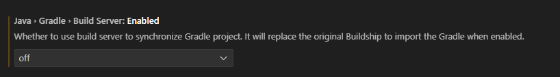

    - Gradle Build Server: Enabled 기본 on -> off

    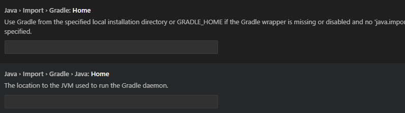

  - Gradle Home -> 환경변수 입력한 GRADLE_HOME의 경로 입력
  - Gradle Java Home -> 현경변수 JAVA_HOME의 경로 입력

  - VS Code 재시작.

## 5일차

### Spring Boot 웹실행

- 프로젝트 초기화

  - Spring Initializr: Create a Gradle Project
  - Specify Spring Boot version: 3.4.4
  - Specify project language: Java
  - Input Group Id: com.hugo83(각자 설정할 것)
  - Input Artifact Id: spring03
  - Specify packaging type: Jar(Java archive, 압축파일)
  - Specify Java version: 17
  - Choose dependencies: Selected 1 dependencies
    - Spring Web
  - 저장위치 선택
  - **새 창 열기** - Spring Boot 프로젝트가 루트폴더가 된 개발환경

- 기본설정

  - application.properties에 `spring.output.ansi.enabled=always` 추가

- 포트번호
  |프로토콜|포트번호|비고|
  |:---|---:|:---|
  |HTTP|80|웹 서비스 포트(보안취약)|
  |HTTPS|443|SSL를 적용한 웹 서비스(보안강화)|
  |FTP|21|웹을 통한 파일전송|
  |TELNET|23|원격서버접속 서비스|
  |SSH|22|보안강화된 텔넷|
  |SMTP|25|메일 전송서비스|

- 개발용포트

  - 포트는 중복안됨
  - 8080포트를 사용하고 있으면 다른 포트로 변경해야 함!
  - 포트 변경시 application.properties에 `server.port=8090` 추가

- 웹브라우저 열기

  - http://localhost:8090/ 오픈

    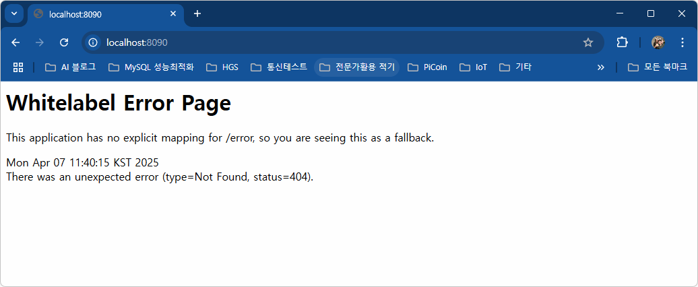

- 접속위치 요청 처리

  - 컨트롤러 생성

    - HelloController 클래스 생성
    - http://localhost:8090/hello

  - 각 기능별로 패키지를 구분
    - controller, model, 등...

### 로그출력

- Log-back

  - 스프링부트에 내장된 로그 모듈

  - application.properties 내 로그설정

  ```groovy
  logging.level.root = info
  logging.file.name = /logtest.log
  ```

  - 사용 시

  ```java
  // 클래스 내 작성
  private final Logger logger = LoggerFactory.getLogger(this.getClass());

  // 메서드 내 사용
  logger.info("hello URL 오픈!");
  // 문제발생시 로그를 남길때
  logger.debug("디버그시 필요한 로그입니다.");
  logger.trace("디버그시 필요한 로그예요.");

  logger.warn("경고표시 나타내는 로그입니다.");
  logger.error("오류표시 나타내는 로그입니다.");
  ```

- Log4J2 외부모듈 사용 권장.

### 스프링부트 배너(중요도 없음)

- resources 폴더에 banner.txt 생성
- 내용 추가
- [Spring Boot Banner Generator](https://devops.datenkollektiv.de/banner.txt/index.html)
- 배너제너레이터로 생성한 글자 복사 banner.txt 붙여넣기
- 서버 재시작

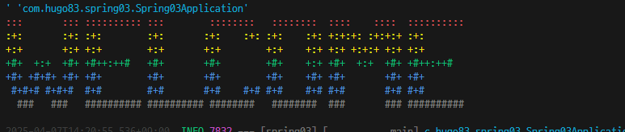

### 메인페이지 추가

- resources/static/index.html 부터 시작

### 스프링부트 프로젝트구조

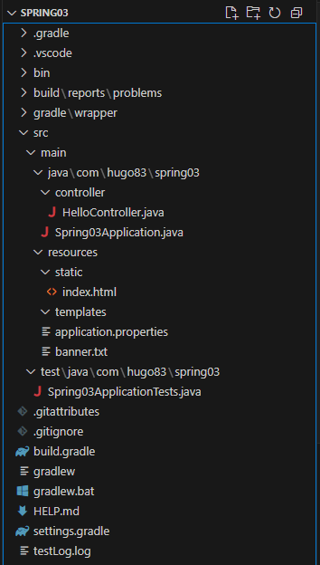

- 각 폴더 구조
  - .gradle ~ gradle : 그레이들, VSCode, 빌드 등에 필요한 폴더(설명필요X)
  - `src/main/java` : 패키지와 자바 소스가 저장되는 위치
  - com.hugo83.spring03 : 패키지. 폴더로 구성
    - HelloController 클래스에 접근하려면
    - com.hugo83.spring03.controller.HelloController 접근해야 함
  - Spring03Application.java : 시작프로그램
  - src/main/resources : 자바파일 이외 HTML, CSS, JS, 환경파일 등 리소스파일 저장되는 위치
    - `static` : CSS, JS, 이미지 파일 저장되는 곳
    - `templates` : 스프링부트와 연계되는 HTML 파일 저장되는 곳
    - `application.properties` : 프로젝트 환경설정 파일. 환경변수, DB 설정
  - src/test/java : JUnit 스프링부트 테스트도구 자바파링 저장되는 위치
  - `build.gradle` : 그레이들 환경 파일. Groovy 기반으로 한 빌드도구. dependencies 만 잘 구성하면 됨
  - gradlew.bat : 중간에 직접 그레이들 빌드를 할때 사용하는 배치파일.
  - settings.gradle : 고급 그레이들 설정. 손댈일 없음

### 스프링부트 어노테이션

#### @SpringBootApplication

- 스프링부트 자동구성 매커니즘 활성화
- 어플리케이션 내 패키지에서 컴포넌트들 스캐닝
- 설정 클래스 임포트해서 활성화, 스프링부트 실행

#### @Controller

- 컴포넌트 구체화해서 해당클래스 IoC컨테이너 Bean으로 등록

#### @GetMapping

- Get, Post 중 Get(URL)으로 들어오는 주소를 매핑. 처리해주는 역할
- @PostMapping, @RequestMapping등 파악

#### @ResponseBody

- HTTP 요청의 자바객체가 처리한 body내용을 매핑하는 역할
- 자바의 String 문자열을 웹페이지에 렌더링

## 6일차(06-30)
- Spring Boot JPA + Oracle + Thymeleaf + React
    - JPA : DB설계 없이 엔티티 클래스만으로 테이블을 자동 생성해주는 기술. SQL도 필요없음
        - JPA 이전 - MyBatis(iBatis). SQL + XML로 구성된 ORM(Object Relational Mapaping) 기술
    - H2 : Oracle, MySQL 등과 달리 인메모리DB. Spring Boot에서 자동으로 실행해주는 DB
        - 개발할 때 사용. 운영시 이전할 때 DB 종류에 관계없이 이전이 가능. 개발동안 사용
    - Thymeleaf : JSP 단점을 보안한 템플릿 형태 FE 개발방식
        - Bootstrap은 필수로 사용
    - 소셜로그인 : 구글, 카카오, 네이버 SSO 로그인 연동(OAuth 2.0)
    - React : FE를 완전 분리

### Spring Boot 프로젝트 생성
1. 명령 팔레트로 시작(Ctrl + Shift + P) : Spring Initializr: Create a Gradle(Maven) Project
    1. Sprint Boot version : 3.5.3
    2. project language : Java
    3. Group Id : com.pknu
    4. Artifact Id : backboard
    5. package type : Jar
    6. Java version : 17
    7. Dependency
        - Spring boot DevTools : 개발시 필요한 명령어, 기능 포함
        - Lombok : 어노테이션 등 편리하게 해주는 폴러그인 라이브러리
        - Spring Web : 프론트엔드(html) 개발을 할 때 필요한 의존성
        - Thymeleaf : html + Spring Boot 태그 매핑을 해주는 기능
        - H2 Database(later) : 개발동안 필요한 인메모리DB
        - Oracle Driver(later) : 실제 운영할 DB
        - Spring Data JPA(later) : DB 생성 + ORM

    8. 저장위치 지정, Genetate into this folder 선택
    9. 오른쪽 하단 프로젝트폴더 Open 버튼 클릭

2. Spring Boot Backboard project
    - Gradle plugin : Dependency 파악. 프로젝트 업데이트
    - Spring Boot dashboard : 프로젝트 실행

3. Spring Boot 설정파일
    - build.gradle : 그레이들에서 설정할 구성내용
    - application.properties : Spring Boot 프로젝트 자체 설정파일
    - settings.gradle, gradle-wrapper.properties : 손댈일 없음

### 스프링부트 Backboard 프로젝트
1. 기본 실행
    1. resources/application.properties

        ```properties
        server.port=9097 # 포트변경
        spring.output.ansi.enabled=always # 로그 색상 설정

        logging.level.root=info   # 로그출력 레벨 설정
        logging.file.name=C:/temp/backboard.log  # 로그파일 위치
        ```

    2. build.gradle, Dependency

        ```gradle
        dependencies {
            // ... 생략

            // DB연동용 의존성
            runtimeOnly 'com.h2database:h2'  // 개발시에만 사용하는 InmemoryDB H2
            implementation 'org.springframework.boot:spring-boot-starter-data-jpa'
        }
        ```

    3. Controller 작업

        - MainController 생성
        - 새 파일로 생성 or Menu Java New file > class 둘 다 동일

    4. /resources/templates/ 에 Mapping 메서드 리턴값과 동일한 html을 작성

2. DB연동
    1. H2 DB 의존성 추가
    2. application.properties에 H2관련 설정 추가

        ```properties
        ## H2 DB 설정
        spring.h2.console.enabled=true
        # 접속 URL
        spring.h2.console.path=/h2-console
        # H2 DB 파일위치 : ~/ (user/Admin/ 에 생성) : ./ 현재프로젝트 폴더 생성
        spring.datasource.url=jdbc:h2:./local
        spring.datasource.driver-class-name=org.h2.Driver
        spring.datasource.username=sa
        spring.datasource.password=
        ```

    3. http://localhost:9097/h2-console 접속
        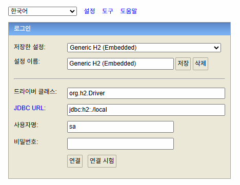

    4. application.properties에 JPA 설정

        ```properties
        ## JPA DB 설정
        spring.jpa.properties.hibernate.dialect=org.hibernate.dialect.H2Dialect
        spring.jpa.hibernate.ddl-auto=update
        ```

        - JPA 등의 ORM 작업시 사용하는 기술 : 하이버네이트
            - spring.jpa.hibernate.ddl-auto 종류
                - create : SB 서버 시작시 테이블을 모두 삭제 후 재생성(데이터모두 휘발)
                - create-drop : create와 동일. 서버가 종료되면 테이블 모두 삭제
                - `update` : 엔티티 변경부부만 적용. 원래 있던 데이터는 존재
                - `validate` : 엔티티와 테이블간 차이점 검사만
                - truncate : 데이터를 전부 날림
                - none : 엔티티가 변경되어도 DB는 변경하지 않음

    5. MVC 패턴에 맞춰 각 기능별로 패키지(폴더) 생성
        - entity, repository, service, controller ...
        - templates 내 html

    6. @(Annotation) 정리
        - Lombok
            - `@Getter` : getter 메서드 자동 생성
            - `@Setter` : setter 메서드 자동 생성
        - JPA
            - `@Entity` : 테이블화 할 객체 선언
            - @Id : 테이블 PK
            - @GeneratedValue(strategy = GenerationType.SEQUENCE)
                - AUTO : JPA가 자동 선별. 사용 지양
                - `IDENTITY` : SQLServer Identity(1, 1), MySQL Auto-Increment
                - `SEQUENCE` : Oracle Sequence
                - H2 DB를 오라클 타입으로 사용하고, 나중에 운영DB를 오라클로 갈아타겠다!
        - @Column : 컬럼의 속성을 변경 (ex: @Column(name="subject", length = 250))
            - name : DB상의 실제 컬럼명을 엔티티와 다르게 사용할 때
            - length : 길이를 지정
            - updatable : 최초 작성이후 수정여부. false는 수정불가
            - columnDefinition : "TEXT" MySQL, "CLOB" Oracle. H2는 사용불가
        - SpringFramework
            - @CreatedDate : 생성일
            - @LastModifiedDate : 최종수정일 에 대한 어노테이션

    7. entity 패키지(폴더) 작성
        1. 테이블로 생성할 Board 클래스 생성
        2. Lombok @Getter/@Setter를 사용하면 Get~, Set~ 메서드를 작성할 필요없음

    8. repository 패키지(폴더) 작성
        1. DB상의 데이터를 조회, 저장, 수정, 삭제할 수 있게 도와주는 인터페이스
        2. SELECT -> findAll(), INSERT -> save() 메서드를 기본 제공
        3. BoardRepository 인터페이스 생성

3. 단위 테스트
    1. build.gradle에 JUnit 의존성 추가

        ```gradle
        // JUnit 단위테스트
        testImplementation 'org.junit.jupiter:junit-jupiter'
        ```
    2. INSERT 단위테스트    
    3. test/.../backboard/BackboardApplicationTests.java 에 단위테스트 메서드 작성

        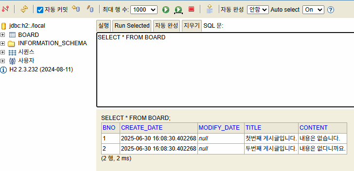

    4. SELECT, SELECT ... WHERE 단위테스트
    5. 디버그콘솔에서 쿼리 로그로 확인. application.properties 설정추가

        ```properties
        # 테스트시 쿼리 확인
        spring.jpa.properties.hibernate.format_sql=true
        spring.jpa.properties.hibernate.show_sql=true
        ```

    6. SELCT ... WHERE LIKE, DELETE FROM 단위테스트

## 7일차(07-01)

### 스프링부트 Backboard 프로젝트(계속)
1. 단위 테스트 
  - UPDATE 테스트

2. DB연동 개발 계속
    1. Entity 중 Board(게시글)의 댓글 Reply 클래스 생성
    2. DB ERD에서 Board : Reply => 1:N(1대 다)를 관계를 가짐
    3. @(Annotation) 추가
        - @OneToMany(mappedBy = "board", cascade = CascadeType.REMOVE) : 1대다 ERD 관계로 부모클래스(테이블)에 작성하는 부분
        - @ManyToOne : 다대1 ERD관계로 자식클래스에 작성하는 부분
        - @Service : 서비스 모듈을 지칭(SpringFramework)
        - @RequiredArgsConstructor : final등의 멤버변수를 파라미터로 생성자를 만들어주는 것(Lombok)
        - @AllArgsContructor : 클래스 멤버변수를 사용해서 생성자를 만들어주는 것(Lombok)
        - @NoArgsContructor : 파라미터(클래스 멤버변수) 없는 빈생성자를 자동으로 생성(Lombok)
    4. ReplyRepository 인터페이스 작성
    5. Service 작성
        - 데이터 처리를 위해서 작성하는 클래스. MVC처럼 패턴처럼 모듈화로 복잡한 코드를 단순화, 역할분리를 위해서
        - Controller는 게이트(문) 사용자가 접속해서 요청하는 부분
    6. 엔티티를 DTO 객체 변환
        - Entity : DB와 연결되어 있는 클래스. 이 객체를 그대로 사용해서 FE로 보내는 방식이 좋지 않음
        - Dto 사용은 옵션으로 할 수도 있음

    7. BoardController 작성
    8. /templates/board_list.html 생성 
        - thymeleaf 문법 적용

          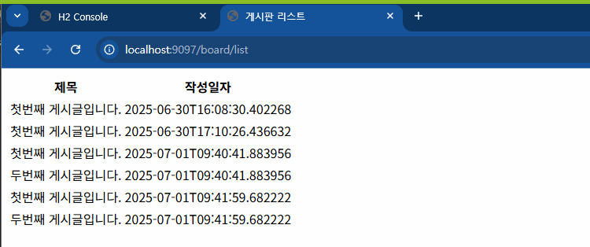

    9. 상세 페이지 작업
        - Service, Controller 메서드 작업

    10. 상세 페이지에 댓글 저장 기능 추가
        - board_detail.html에 댓글 저장 폼양식 추가
        - ReplyService, ReplyController 각각 생성, 작성
    
3. thymeleaf 문법
    - ${} : 변수 표현식. 변수에 들어있는 값을 화면에 표시하는 기능. Model에 들어있는 데이터를 화면에 표시
    - @{} : URL링크 표현식. 정적인 링크 또는 라우팅되는 경로를 생성하는 기능
    - #{} : 메시지 표현식
    - *{} : 선택변수 표현식. th:object 로 선택된 객체 내의 값에 접근
    - ~{} : Fragment포함 표현식. 템플릿 Fragement를 사용
    - thymeleaf 속성에만 사용가능 : th:text, th:href ... 

4. 웹 페이지 디자인
    1. resources/static : css, js, 정적html 파일들이 위치
    2. static/main.css : 전체에서 사용할 css 파일
    3. Bootstrap 적용
      - https://getbootstrap.com Current v5.3.7 download 클릭
      - https://github.com/twbs/icons/releases/tag/v1.13.1 
    4. board_detail.html : 부트스트랩 적용
  
5. 전체 HTML에 디자인 적용
    1. build.gradle에 thymeleaf-layout 의존성 추가
        ```gradle
        // Thymeleaf layout 의존성 추가. 250701. 신규추가. Hugo.
	      implementation 'nz.net.ultraq.thymeleaf:thymeleaf-layout-dialect'
        ```

    2. 레이아웃 템플릿 페이지 작성
    3. board_list.html 에 적용    

        https://github.com/user-attachments/assets/e34d7247-6812-448f-b198-fd0b3896a657


## 8일차
### 스프링부트 Backboard 프로젝트(계속)
1. DB연동 개발
    1. 게시글 등록 기능
    2. Spring Boot Validation 기능 추가 : 입력 검증

        ```gradle
        // 추가 의존성
	      implementation 'org.springframework.boot:spring-boot-starter-validation'
        ```
        - Annotation으로 검증 수행
            - @Size, @NotNull, @NotEmpty, @Past(과거날짜만 가능), @Future(미래날짜만)
            - @FutureOrPresent(미래또는 오늘날짜만), @Pattern(정규식패턴)

    3. 입력검증 클래스, BoardForm.java 생성
    4. BoardForm 객체를 컨트롤러에 전달
    5. board_create.html에 입력검증 태그, 속성 등 추가
        - GetMapping, PostMapping 메서드에 BoardForm 파라미터를 추가!

    6. board_detail.html에 댓글 입력 검증 태그 추가
        - ReplyController 의 PostMapping 메서드에 ReplyForm을 파라미터로 추가
        - BoardController의 GetMapping 메서드에 ReplyForm을 @Valid 파라미터로 추가        

    7. 검증영역 태그를 valid_error.html 템플릿 생성

2. Bootstrap 템플릿 사이트
    - https://startbootstrap.com/
    - https://bootstrapmade.com/bootstrap-5-templates/
    - https://mdbootstrap.com/freebies/
    - https://bootstrapmade.com/
    - https://www.youtube.com/@codehal (No Bootstrap)

3. Bootstrap Navigation 구현
    - templates/layout.html 네비게이션 태그 작성

4. Paging : 대량 데이터 로드시 속도 개선
    - Dummy Data 생성 : Unit 테스트로 대략 200건 입력
    - Page, Pageable 인터페이스
        ```java
        import org.springframework.data.domain.Page;
        import org.springframework.data.domain.Pageable;
        ```

    - BoardRepository 인터페이스에 페이징용 findAll() 재정의
    - BoardService 클래스에 페이징용 getBoardList() 오버로딩 작성
    - BoardController 클래스에 getList()에 페이징 파라미터 추가
    - board_list.html에 페이징 컨트롤 추가

        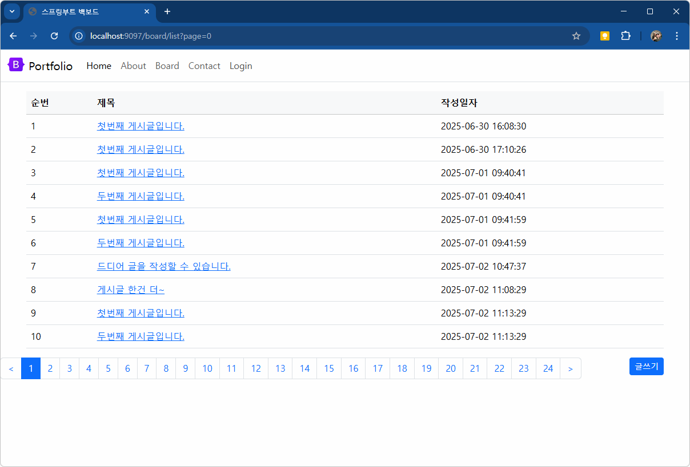

    - 페이징번호가 모두 표시되는 문제 발생

## 9일차

### 스프링부트 Backboard 프로젝트(계속)
1. 게시판 작업
    1. Paging 구현 계속
        - 페이지수가 10개 안넘도록 처리
        - 이전페이지, 다음페이지 사용여부 변경
        - 맨첫페이지, 마지막페이지 버튼 추가

    2. 게시글 최신 글부터 나오도록 정렬
        1. BoardService getBoardList() 메서드에 정렬로직 추가
      
    3. 게시글 개수만큼 번호가 나오도록 수정
        1. 현재는 각 페이지마다 1~10까지 반복
        2. 게시물번호 = 전체 게시물개수 - (현재페이지번호 * 10[페이지당 게시글 수]) - 페이지당 인덱스
        3. board_list.html의 `<td th:text="${index.count}"></td>` 를 수정

    4. Bootstrap 배지로 각 게시글마다 댓글개수 표시
        - MyBatis로 작업된 Spring Boot : 쿼리변경, 도메인변경, html까지 세군데 수정
        - JPA로 작업된 Spring Boot : html만 수정하면 끝!!!
        - board_list.html의 제목 태그에 추가

        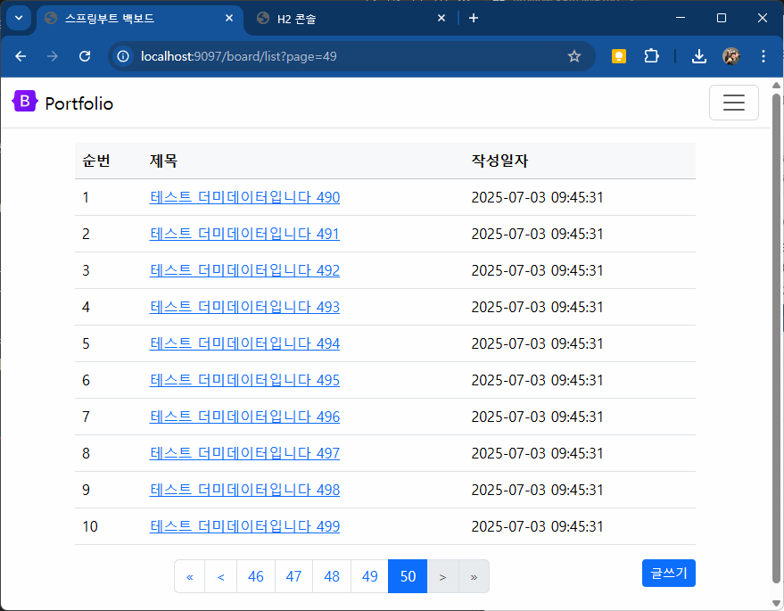

2. Spring Boot Security : 회원가입, 로그인 등을 손쉽게 개발하도록 도와주는 의존성 라이브러리
    1. 시큐리티 설치 
        ```gradle
        // 스프링부트 시큐리티 의존성
        implementation 'org.springframework.boot:spring-boot-starter-security'
        implementation 'org.thymeleaf.extras:thymeleaf-extras-springsecurity6'
        ```

    2. 로그인 화면 및 H2 DB 사용불가
        - 기본사용자 : user
        - 패스워드 : Spring Boot 로그에 표시(ex: e197e2f2-6d99-4296-b3c3-5eef0e2aefb7)
    3. 스프링 시큐리티 설정
        1. /security/SecurityConfig 클래스 생성

    4. 웹 보안용어
        - CORS : Cross-Origin Resource Sharing
            - 기본적으로 서로 다른 오리진(웹서버)인 경우 리소스를 서로 사용할 수 없음            
        - CSRF : Cross-Site Request Forgery
            - 명시적인 동의 없이 사용자를 대신해서 웹 앱이 악의적인 행동을 취하는 공격

    6. 스프링 시큐리티 설정 (계속)
        1. SecurityConfig 클래스 내 filterChain 메서드에 CSRF 등 관련 설정 추가
    
    7. 회원가입 구현
        1. Member 엔티티 클래스 작성
        2. MemberRepository 인터페이스 작성
        3. MemberService 클래스 작성
        4. MemberForm 클래스 작성
        5. MemberController 클래스 작성
        6. templates/signup.html 작성

    8. MainController에 URL / 관련 메서드 작업
        - @GetMapping("/")    

    9. 중복회원 방지 처리
        1. MemberRepository 커스텀 메서드 추가
        2. MemberService 중복여부 체크 메서드 추가
        3. MemberController, setSignUp 메서드 수정

    10. 회원 로그인
        1. SecurityConfig 클래스에 로그인관련 filterChain 추가
  
## 10일차

### 스프링부트 Backboard 프로젝트(계속)

2. Spring Boot Security (계속)
    1. 회원 로그인
        1. MemberRole enum : 스프링 시큐리티에서 역할분배(Admin, User)
        2. MemberSecurityService : 스프링 시큐리티를 사용하는 로그인 서비스
            - UserDetailsService 스프링 시큐리티 인터페이스를 구현
        3. SecurityConfig 계정관련 메서드 추가
        4. signin.html
        5. MemberController 에 GetMapping 메서드 작업

    2. 로그인 오류 처리
        1. SecurityConfig 클래스에 BCryptPasswordEncoder 생성메서드 추가
        2. MemberService 의 setMember() 패스워드 인코딩시 사용변경
      
    3. 회원 로그아웃 기능
        1. layout.html 네비게이션 메뉴 signin, signout 태그 분리
        2. SecurityConfig 클래스 filterChain() 메서드 내 logout 관련 설정


3. 개발용 H2 데이터베이스 -> Oracle로 이전
    1. build.gradle 에 의존성 추가

        ```gradle
        runtimeOnly 'com.oracle.database.jdbc:ojdbc11'   // 운영용 Oracle         
        ```
    2. application.properties에 Oracle 연동관련 설정 추가
        
        ```properties
        ## Oracle 설정
        spring.datasource.url=jdbc:oracle:thin:@localhost:1521:XE
        spring.datasource.driver-class-name=oracle.jdbc.OracleDriver
        spring.datasource.username=madang
        spring.datasource.password=madang

        ## JPA DB 설정
        # H2용
        # spring.jpa.properties.hibernate.dialect=org.hibernate.dialect.H2Dialect
        spring.jpa.properties.hibernate.dialect=org.hibernate.dialect.OracleDialect
        ```

4. 도커에 Oracle 21c XE 설치
    - 11g 사용중 1521포트 사용 중인 상태에서 도커로 21c 설치

        ```shell
        > docker pull gvenzl/oracle-xe:21
        ...
        > docker run -d --name oracle-21-xe -p 11521:1521 -p 8989:8989 -e ORACLE_PASSWORD=oracle gvenzl/oracle-xe:21
        ```

    - Oracle 21 도커 터미널 접근. DB 생성

        ```shell
        > docker exec -it oracle-21-xe bash
        bash-4.4$ sqlplus / as sysdba
        SQL> create user backboard identified by 12345;      
        User created.
        SQL> grant connect, resource to backboard;
        Grant succeeded.
        SQL> alter user backboard QUOTA UNLIMITED ON USERS;
        User altered.
        ```

5. DB 테이블 연동 작업
    1. Board에 글쓴이 컬럼 추가
        1. Board에 Member 클래스변수 추가
        2. BoardService setBoardOne()에 사용자 Member 파라미터 추가
        3. MemberService getMember() 메서드 추가
        4. BoardController setCreate() 메서드 내 서비스 setBoardOne() 메서드에 Principle 추가 수정
        5. 계정세션이 없는 상태에서 작성을 하면 예외발생 - BoardController 계정관련 어노테이션 `@PreAuthorize` 추가
        6. SecurityConfig에 계정세션 접근권한 어노테이션 `@EnableMethodSecurity` 추가 
        7. board_list.html 에 작성자 표시 태그 추가
        8. board_detail.html 에 작성자 표시 태그 추가

    2. Reply에 글쓴이 컬럼 추가
        1. Reply에 Member 클래스 변수 추가
        2. ReplyService에 사용자 Member 파라미터 추가
        3. ReplyController setReply() Principle 추가
        4. ReplyController @PreAuthorize 추가
        5. board_detail.html 댓글부분에 계정관련 태그, 작성자 표시 태그 추가

    3. Board 게시글 수정, 삭제 추가
        1. board_detail.html 수정, 삭제 버튼 추가
        2. BoardService에 게시글 수정메서드 putBoardOne(), 삭제메서드 deleteBoardOne() 추가
        3. BoardController에 게시글 수정 GetMapping 메서드 추가
        4. board_create.html th:action을 삭제, 등록과 수정을 동시에 처리할 수 있는 hidden태그를 작성
        5. BoardController에 수정 PostMapping 메서드 추가


https://github.com/user-attachments/assets/6c18f07c-a836-4d91-9f1c-8ff51d7b8fdb


## 11일차

### 스프링부트 Backboard 프로젝트(계속)

1. VS Code 재설치시 삭제해야할 폴더
    - VS Code 제거
    - C:/Users/계정/.vscode : 플러그인 등 구성
    - C:/Users/계정/AppData/Roaming/Code : 전체설정, 백업, 캐시 등 가장 큰 폴더
    - VS Code 재설치

2. DB 테이블 연동 작업 (계속)
    1. board_detail.html 수정일자 표시
    2. Board 게시글 삭제 추가
        1. board_detail.html 삭제 버튼 추가
        2. ~~BoardRepository에 삭제처리 로직 추가 필요없음~~
        3. BoardService에 삭제처리 로직 추가
        4. BoardController에 삭제처리 GetMapping 추가

3. 댓글에 대한 수정, 삭제
    - 게시판과 동일하게 작성하면 됨
    
4. 좋아요 기능 추가
    1. Board Entity에 `Set<Member> like` 속성 추가    
    2. board_detail.html 좋아요 버튼 추가
    3. BoardService like 관련 메서드 추가
    4. BoardController 에서 /board/like/{bno} GetMapping 추가
    5. Reply Entity에 `Set<Member> like` 속성 추가
    6. board_detail.html 댓글 부분에 좋아요 버튼 추가
    7. ReplyService 답변가져오기 메서드 getReply() 추가
    8. ReplyService like 관련 메서드 추가
    9. ReplyController 에서 /reply/like/{rno} GetMapping 추가

5. 커스텀 에러페이지 처리
    1. application.properties 에서 Whitelabel Error 설정 해제
    2. templates/error/500.html 생성
    5. 템플릿 사이트
        - https://freefrontend.com/html-404-templates/
        - https://freefrontend.com/html-500-templates/

6. 웹 html 에디터 적용
    1. HTML 에디터 종류
        - https://ckeditor.com/ckeditor-5/ : 전세계에서 가장 유명한 유무료 웹에디터
        - https://alex-d.github.io/Trumbowyg/ : jQuery가 필요한 간단한 무료 웹에디터
        - https://summernote.org/ : 정말 간단한 웹에디터
        - https://simplemde.com/ : 마크다운만 사용하는 웹에디터
    2. Trumbowyg 적용
        1. jQuery CDN 적용
        2. layout.html에 trumbowyg 관련 css, js 링크 추가
        3. board_create.html에 content textarea와 관련된 스크립트 작성
        4. 추가 플러그인 js 링크 추가
    
        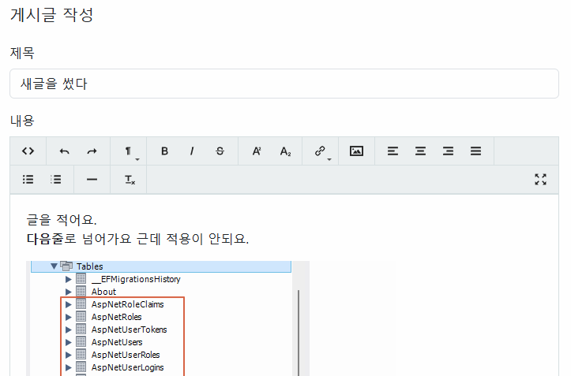

7. 게시판 검색 기능 추가
    1. `@Query` : DATA JPA Query annnotation, JPA 상에서 SQL쿼리와 유사한 방식으로 부가적인 기능을 만들고자할 때 사용. 표준 SQL이 아니라서 DBeaver, MySQL Workbench등에서 사용불가
    2. BoardRepository 에 JPA Query 어노테이션 사용 메서드 추가
    3. BoardService 에 getBoardList() 변경
    4. BoardController 에 getList() 키워드 파라미터 추가
    5. board_list.html 검색부분 추가


    
## 12일차

### 스프링부트 Backboard 프로젝트(계속)
1. 현재 게시판 검색 중 발생 문제
    - Board의 content 변수(테이블 컬럼), Column(length = 8000) 인 경우
    - Oracle에서 컬럼 타입이 CLOB(Character Large OBject) 로 생성
    - CLOB : 최대 2GB 텍스트 데이터 저장가능. 대용량 저장 가능
    - 단, WHERE LIKE 문 사용불가
    - Query annotation에서 `select distinct`를 사용하면 CLOB 컬럼 조회와 충돌발생
    - 해결방법
        1. Oracle Text : 검색용 인덱스를 추가 생성. JPA Native query로 CONTAINS() 함수 사용
        2. ElasticSearch : 외부 서비스 사용해서 검색을 최적화. 도커에 엘라스틱서치 설치, 연동
        3. 검색용 필드 추가 : VARCHAR(4000) 검색용 필드 content_search 컬럼 추가생성. content에서 html 태그 제거, 검색가능 단어만 저장하는 컬럼

2. 게시판 검색 (계속)
    1. BoardRepository findAllByKeyword의 `@Query` 를 편집. reply 제거, distinct 키워드 제거
    2. 11일차 게시판 검색 기능 추가와 동일
    3. board_list.html 검색부분, form 히든영역, javascript 추가

3. 파일업로드
    1. Board Entity에 파일업로드 관련 변수 -> 컬럼
    2. BoardController 게시글 저장 메서드에 파일업로드 로직 추가
    3. BoardService setBoardOne() 메서드 수정
    4. application.properties 에 파일 업로드 위치 설정
    5. board_create.html에 파일업로드 입력 + form 태그 enctype 속성 추가
    6. board_detail.html에 파일다운로드 링크 추가
    7. BoardController에 파일 다운로드 GetMapping 메서드 추가
    8. 게시글 수정 시 업로드 관련 처리
        - BoardForm 클래스에 파일업로드 관련 필드 추가(Board 엔티티와 동일)
    9. BoardController 수정관련 GetMapping 메서드에 로직추가
    10. BoardService putBoardOne() 메서드에 파일관련 파라미터 추가, 로직 수정
    11. 파일업로드 사이즈 설정 - application.properties
    12. 파일업로드시 파일명에 한글이 있으면 문제발생! - 한글을 UTF로 인코딩해서 저장

## 13일차

### 스프링부트 Backboard 프로젝트(계속)
- 시맨틱웹
    - 웹사이트의 화면 구성을 쉽게 알수 있도록 특수 태그형태의 기술
    - 특수태그 : header, main, section, article, aside, footer

1. 부트스트랩 프리테마 NiceSchool로 변경
    1. 초기 작업
        1. assets 폴더 복사해오기
        2. favicon 커스터마이징
        3. 구글폰트 구성
        4. 3rd party vendor 라이브러리 css, head내 구성
        5. 메뉴 부분 header 태그 복사
        6. main 태그를 th:block과 동일하게 사용 class="main" 
        7. footer 태그 아래는 복사, src 주소 변경
        8. header > nav 메뉴, 주소 변경
    2. Index 페이지 관련 이전
        1. 타임리프 태그 아래에 이전

            ```html
            <html layout:decorate="~{layout}">
                <div layout:fragment="content">
                    <!-- 여기에 복사 -->
            ```
        2. 이미지, 동영상 경로 일치

    3. 전체 메뉴 링크 관련된 페이지 작업
        1. 404.html
        2. IntroController 클래스 생성, /intro/about GetMapping메서드 작성
        3. templates/intro/about.html 생성
        4. 동일하게 페이지 옮기기 

## 14일차

### 스프링부트 Backboard 프로젝트(계속)
1. 부트스트랩 프리테마 NiceSchool로 변경
    1. 버튼 CSS 변경 
    2. `th:style="|background-image: url('@{/img/education/showcase-1.webp}')|"` 오류해결
    3. About DB연동
        1. 전체 내용 Entity
        2. 역사 리스트용 Entity
        3. AboutRepository 
        4. AboutService
        5. IntroController를 수정
        6. about.html 타임리프와 연동

    4. 관리자(사용자)가 쉽게 데이터를 입력할 수 있는 화면 개발
        1. layout.html 에 관리자 메뉴 추가
        2. AdminController 생성 @GetMapping("/manage") 메서드 생성
        3. /admin/manage.html을 board_detail.html 입력화면 작업

        4. AdminController @PostMapping("/about") 메서드 생성
        5. History 관련 리스트 및 입력화면 html 추가
        6. AdminController @PostMapping("/history/{id}") 메서드 생성
        7. HistoryRepository, HistoryService 생성 작성

## 15일차

### 스프링부트 Backboard 프로젝트(계속)
1. 부트스트랩 프리테마 NiceSchool로 변경
    1. 관리자 화면 history 수정 부분 완료

2. AWS Lightsale로 업로드
    1. Oracle DB 구축 -> H2
    


9. 나중에 추가해야할 부분
    1. [x] 회원가입 후 바로 로그인되는 기능
    2. [x] 로그인한 사람 표시기능
    3. [ ] 테마(라이트, 다크) - 패스
    4. [x] 파일 업로드
    5. [x] 부트스트랩 프리테마 NiceSchool로 변경
    6. [ ] 파일사이즈 초과시 JS로 방지
    7. [ ] 구글로그인
    8. [ ] AWS 라이트세일 업로드
    9. [ ] 게시글에 이미지 추가시 img 태그에 width="100%" 추가작업
    10. [ ] 사용자 정보에 Role 추가
 